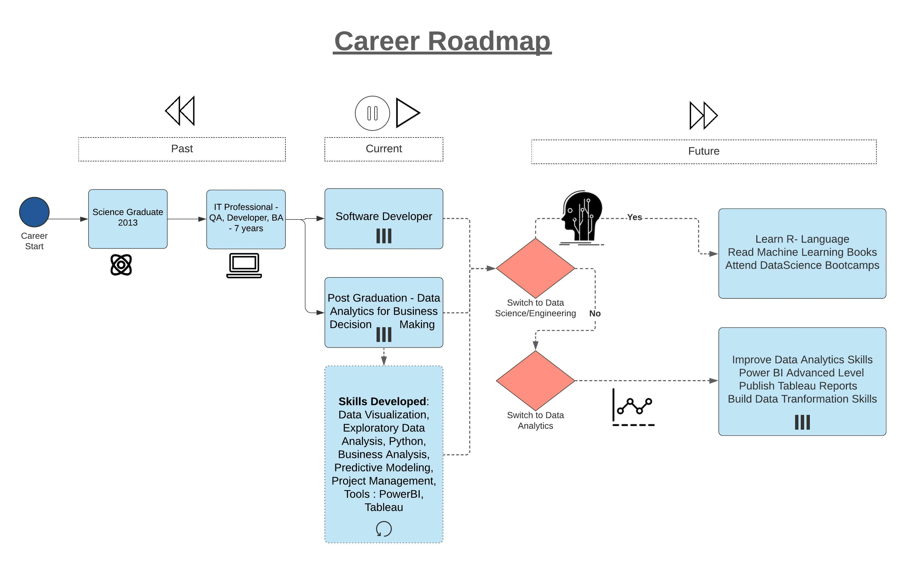
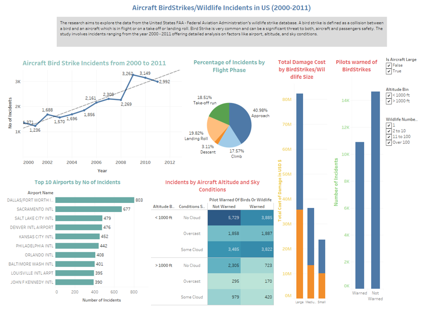
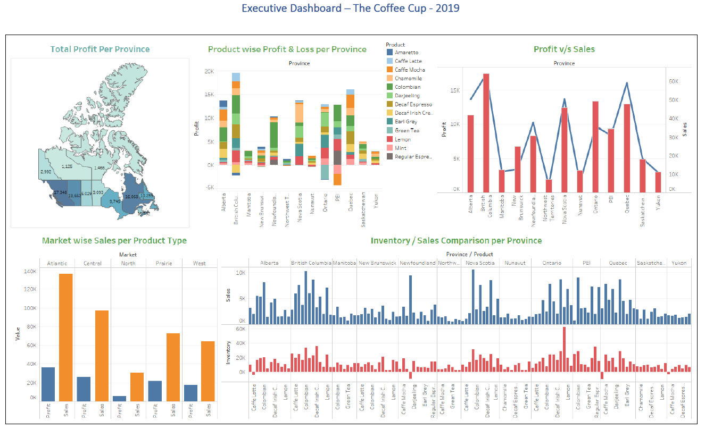

#             Portfolio

## ▪ About me

Software Development Specialist in Data Migration with an experience of working in the Telecom Domain. Skilled in Informatica Power Center, Developer, Oracle, Data Migration, Transformation Projects, ETL- DWH projects. Experienced in Telecom software development and quality teams in data/system migration projects in the BSS stack.

# [My Career Roadmap]

---
## ▪ Work Experience

[Resume](/sample_page)

---

## ▪ Education

###  ▪ Post Graduate Certificate | 2021
Data Analytics for Business Decision Making

Durham College, Oshawa, Canada

### ▪ Bachelor of Science | 2013
Mathematics, Computer Sciences, Electronics

Osmania University, Hyderabad, India

---

## ▪ Skillset

[Skills](/sample_page1.md)

---
## ▪ Things I care about

▪ Global Warming

▪ Internet Freedom

---
## ▪ Languages

▪ English - Full Professional Proficiency

▪ Telugu – Native or Bilingual Proficiency

▪ Hindi - Full Professional Proficiency

---

[Download PDF Resume](/pdf/ravitejapv_resume.pdf)

---

### Individual Data Visualization Projects

- [Aircraft Birdstrikes/Wildlife Incidents in the US](https://youtu.be/25qFgbAm5iA)

- [Coffee Cup Data Analysis](/pdf/CoffeeCup.pdf)

